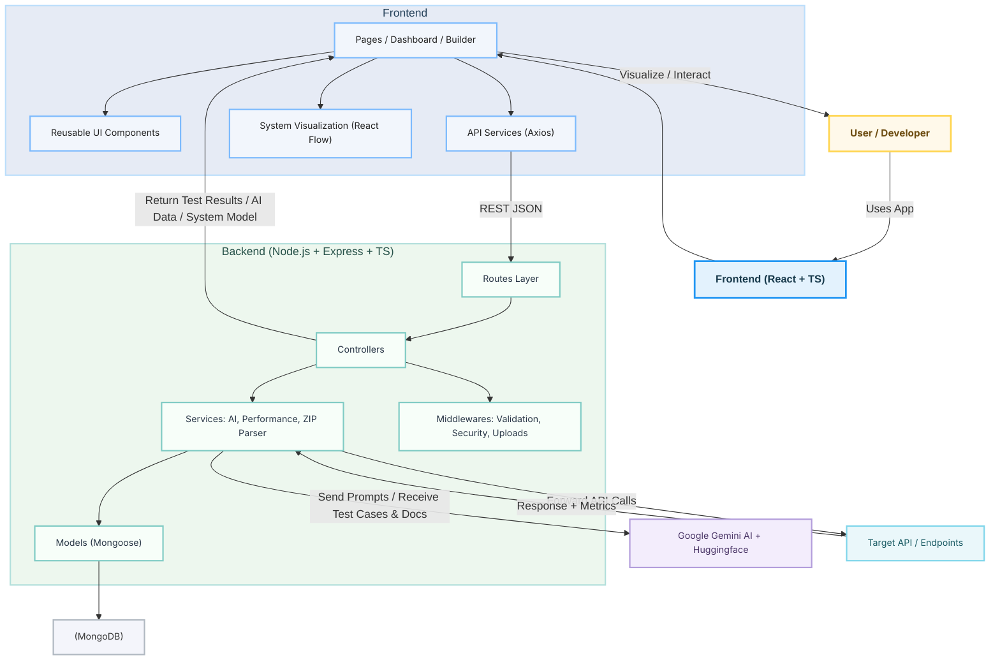

# 🛠️ Visual API Testing Platform — Backend

### Node.js + Express + TypeScript + MongoDB

The backend powers AI-driven test generation, API testing, ZIP import analysis, performance benchmarking, and project management. Built with extensibility, modularity, and SOLID principles.

---

# 📦 Core Features

* 🤖 **AI Test Generation** using Google Gemini API + Huggingface
* 📦 **ZIP Import & System Extraction** (route, controller & file structure parsing)
* ⚙️ **Performance Testing Engine** (concurrency, latency, throughput)
* 📝 **Auto-Documentation Generator**
* 🔐 **Security Middleware** (Helmet, CORS, rate-limiting)
* 🧱 **Layered Architecture** (Controllers → Services → Models)

---

# 🧱 Folder Structure

```
be/
├── src/
│   ├── config/         # ENV, DB connection
│   ├── controllers/    # Handles HTTP requests
│   ├── services/       # Business logic (AI, performance, parsing)
│   ├── models/         # MongoDB schemas
│   ├── routes/         # API route definitions
│   ├── middlewares/    # Error handling, validation, multer
│   └── utils/          # Parsers, regex, helpers
└── package.json
```

---

# 🛠️ Tech Stack

* **Node.js + Express**
* **TypeScript**
* **MongoDB + Mongoose**
* **Google Gemini API + Huggingface**
* **Multer** (file uploads)
* **Helmet / CORS / Express Rate Limit**
* **Zlib / Streams** for ZIP parsing

---

# 🖥️ Local Development

## 1️⃣ Clone Repository

```bash
git clone https://github.com/SwitchBladeAK/apitesterbe.git
cd api_tester_project/be
```

## 2️⃣ Install Dependencies

```bash
npm install
```

## 3️⃣ Setup Environment Variables

```bash
cp .env.example .env
```

### Required ENV Keys:

```env
PORT=5000
MONGODB_URI=mongodb://localhost:27017/api_tester_db
GEMINI_API_KEY=your_google_gemini_key
CORS_ORIGIN=http://localhost:3000
```

---

# 🚀 Run Development Server

```bash
npm run dev
```

Server runs at:
📌 **[http://localhost:5000](http://localhost:5000)**

MongoDB must be running.

---

# 📦 Build for Production

```bash
npm run build
```

Output folder:

```
be/dist/
```

---

# 🧰 Available Scripts

| Command         | Description                |
| --------------- | -------------------------- |
| `npm run dev`   | Start dev server (ts-node) |
| `npm run build` | Build TypeScript → JS      |
| `npm start`     | Start production server    |
| `npm test`      | Run tests (optional)       |

---

# 🧪 API Endpoints Overview

### 🔹 Projects

```
POST   /api/projects
GET    /api/projects
GET    /api/projects/:id
PUT    /api/projects/:id
DELETE /api/projects/:id
```

### 🔹 Endpoints

```
POST   /api/projects/:projectId/endpoints
PUT    /api/projects/:projectId/endpoints/:endpointId
DELETE /api/projects/:projectId/endpoints/:endpointId
POST   /api/projects/:projectId/endpoints/:endpointId/test
```

### 🔹 AI Features

```
POST /api/projects/:projectId/ai/generate-test-cases
POST /api/projects/:projectId/ai/generate-documentation
POST /api/projects/:projectId/ai/analyze-system-design
```

### 🔹 ZIP Import

```
POST /api/projects/:projectId/import-zip
```

### 🔹 Performance Testing

```
POST /api/projects/:projectId/endpoints/:endpointId/performance-test
```

---

# 🔐 Security

* Helmet for secure HTTP headers
* CORS whitelisting
* Rate limiting
* Sanitized file uploads
* Input validation

---

# 🧪 Recommended Testing Stack

* **Jest**
* **Supertest** for API integration tests
* **MongoDB Memory Server** for isolated test DB

---

# 🐳 Docker Support

```bash
docker build -t api-tester-be .
docker run -p 5000:5000 api-tester-be
```

---

# 🌐 Architecture Diagram



---

